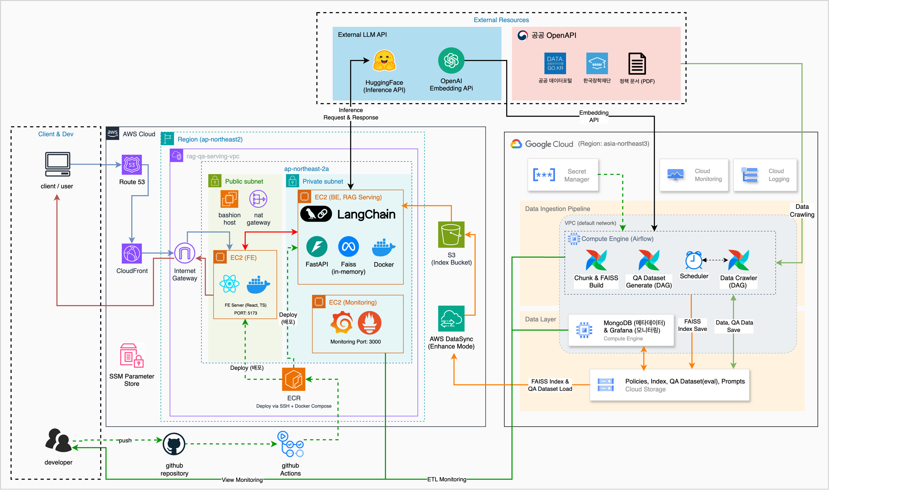
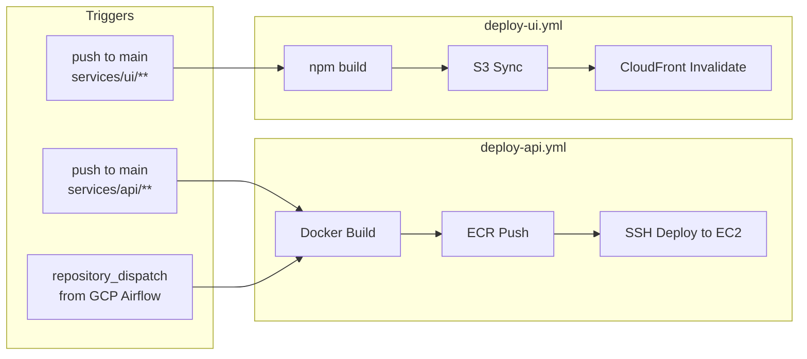
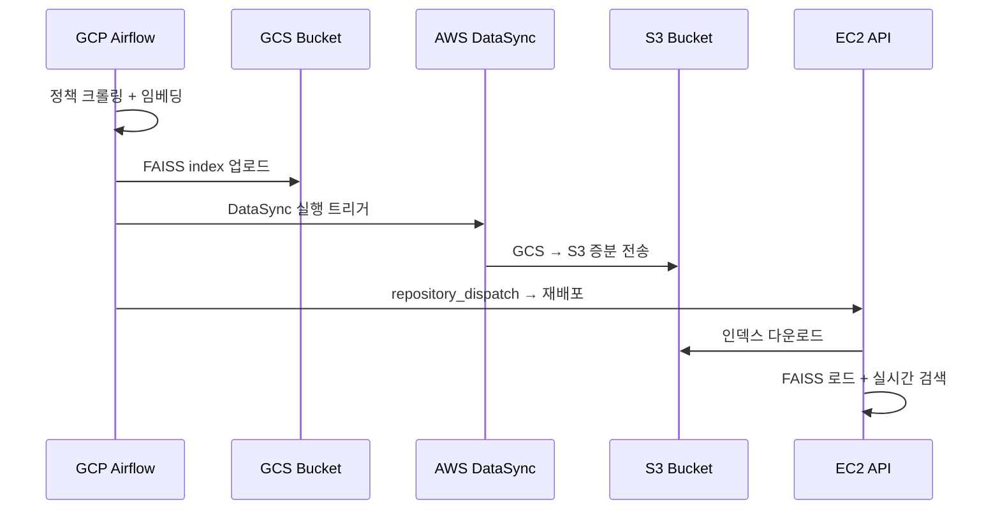

# Policy Pass — AWS Online Serving Infrastructure

청년정책 RAG QA 시스템 **Policy Pass**의 AWS 인프라를 관리하는 레포지토리입니다.

GCP(Offline Pipeline)에서 데이터 수집, 임베딩, FAISS 인덱스 빌드를 수행하고,
AWS(Online Serving)에서 인덱스를 로드하여 실시간 검색, LLM 응답, UI 서빙을 담당합니다.

> **인프라 전용 레포** — 애플리케이션 소스 코드는 별도 레포에서 관리됩니다.

## Architecture



## AWS 리소스 현황

| Service | Resource | ID / Value |
|---------|----------|------------|
| **VPC** | policy-pass-vpc | `vpc-02bdbd24195a7a8f8` (10.0.0.0/16) |
| **EC2** | policy-pass-api (t3.medium) | `i-0fe59710ffcf75aa1` / 3.35.151.233 (EIP) |
| **EC2** | policy-pass-monitor (t3.small) | `i-08ba9acd4db6d29ce` / 3.35.247.34 (EIP) |
| **S3** | FAISS 인덱스 | `rag-qa-index-355206939988` |
| **S3** | UI 정적 호스팅 | `policy-pass-ui-355206939988` |
| **CloudFront** | UI CDN | `E2HV6ON5OEZJTS` / dnoi7zxhwqqog.cloudfront.net |
| **ECR** | API 이미지 | `rag-api` |
| **DataSync** | GCS → S3 | `task-0981d5902107c4cb5` |
| **SSM** | 시크릿 관리 | `/rag-qa/*` (8 params) |
| **CloudWatch** | 알람 | CPU high (2) + Status check (2) |

## Quick Start

### 사전 요구사항

- AWS CLI v2 (`aws configure --profile policy-pass`)
- Docker
- AWS 계정 (355206939988, ap-northeast-2)
- GCS HMAC 키 (DataSync용)

### 인프라 구축 (순차 실행)

```bash
cd infra/scripts

# Phase A: Foundation
./01-setup-iam.sh          # IAM 역할
./02-setup-ecr.sh          # ECR 레포
./03-setup-s3.sh           # S3 버킷

# Phase B: Data Sync + Secrets
export GCS_HMAC_ACCESS_KEY="..."
export GCS_HMAC_SECRET_KEY="..."
./04-setup-datasync.sh     # DataSync GCS → S3

export OPENAI_API_KEY="sk-..."
export MONGODB_URI="mongodb://..."
./05-setup-ssm.sh          # SSM 파라미터

# Phase D: Compute + CDN
./06-setup-ec2.sh          # EC2 + Security Groups
./09-setup-cloudfront.sh   # S3 UI 버킷 + CloudFront + OAC

# Phase E: Monitoring
./07-setup-monitoring.sh   # CloudWatch 알람
```

### 운영

```bash
./infra/scripts/toggle-instances.sh start   # EC2 시작
./infra/scripts/toggle-instances.sh stop    # EC2 중지 (비용 절약)
./infra/scripts/08-teardown.sh              # 전체 리소스 삭제
```

## CI/CD



### GitHub Secrets

| Secret | 설명 |
|--------|------|
| `AWS_ACCESS_KEY_ID` | IAM 액세스 키 |
| `AWS_SECRET_ACCESS_KEY` | IAM 시크릿 키 |
| `EC2_API_HOST` | API EC2 Elastic IP |
| `EC2_MONITOR_HOST` | Monitor EC2 Elastic IP |
| `EC2_SSH_KEY` | SSH 프라이빗 키 |
| `UI_S3_BUCKET` | UI S3 버킷명 |
| `CLOUDFRONT_DISTRIBUTION_ID` | CloudFront 배포 ID |
| `API_BASE_URL` | API 엔드포인트 URL |
| `GEMINI_API_KEY` | AI 코드 리뷰용 |

## FAISS 인덱스 플로우



## 비용 추정

| Service | 월 비용 | 비고 |
|---------|--------|------|
| EC2 API (t3.medium) | ~$30 | On-demand |
| EC2 Monitor (t3.small) | ~$15 | On-demand |
| CloudFront + S3 UI | < $1 | 프리티어 범위 |
| ECR | ~$1 | 이미지 저장 |
| S3 (인덱스) | < $1 | FAISS 파일만 |
| DataSync | ~$0.04/GB | 전송량 기준 |
| SSM / CloudWatch | ~$1-3 | |
| **상시 운영** | **~$48/월** | |
| **개발 모드 (EC2 중지)** | **~$3-5/월** | EBS + 스토리지만 |

## 레포지토리 구조

```
policy-pass-infra-aws/
├── infra/scripts/              # AWS 인프라 셋업 스크립트 (01~09)
├── services/
│   ├── api/                    # API 컨테이너 (Dockerfile, .env.example)
│   └── ui/                     # UI 빌드 설정 (package.json)
├── monitoring/                 # Prometheus + Grafana docker-compose
├── docs/                       # 인프라 계획서, 콘솔 가이드
├── .github/workflows/
│   ├── aws/                    # API/UI 배포 워크플로우
│   └── pr-agent.yml            # Gemini AI 코드 리뷰
└── .pr_agent.toml              # AI 리뷰 설정
```

## 관련 레포

| 레포 | 역할 |
|------|------|
| [policy-pass-be](https://github.com/RAG-QnA-Eval-Lab/policy-pass-be) | FastAPI 백엔드 |
| [policy-pass-fe](https://github.com/RAG-QnA-Eval-Lab/policy-pass-fe) | React 프론트엔드 |
| [policy-pass-datapipeline-gcp](https://github.com/RAG-QnA-Eval-Lab/policy-pass-datapipeline-gcp) | GCP 데이터 파이프라인 |

## 문서

- [AWS Infrastructure Plan](docs/aws-infrastructure-plan.md) — 상세 아키텍처 결정사항
- [AWS Console Guide](docs/aws-console-guide.md) — 콘솔 설정 가이드
- [Multicloud Architecture](docs/multicloud_architecture_summary.md) — GCP/AWS 역할 분담
